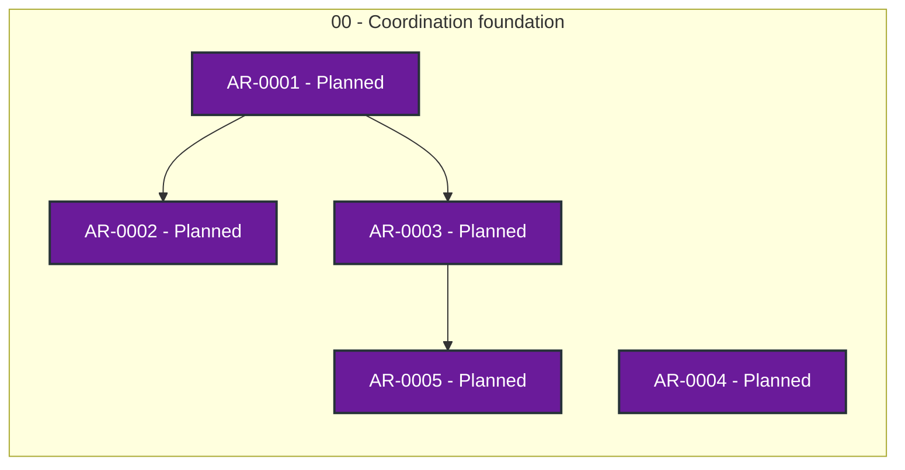

# Agent Workflow status

> Generated deterministically from task front matter. Do not edit this file directly.
> Status records coordination progress; it is not evidence that product behavior is accepted.

## Portfolio overview

**5 ARs tracked** across 1 active status categories.

| Status | Meaning | Count |
| --- | --- | ---: |
| **In progress** | Claimed work with a live lease | 0 |
| **Open** | Dependency-ready and available to claim | 0 |
| **Blocked** | Cannot proceed until its recorded blocker clears | 0 |
| **Planned** | Defined work awaiting promotion or dependencies | 5 |
| **Future** | Deferred roadmap work | 0 |
| **Done** | Accepted, integrated, and durably verified | 0 |
| **Cancelled** | Stopped with a recorded rationale | 0 |
| **Superseded** | Replaced by another AR | 0 |

## Dependency graph

Arrows point from each prerequisite to the work that depends on it. Color is redundant
with the status text inside every node; the tables below are the complete text
alternative.

### Accessible dependency index

| AR | Prerequisites | Dependents |
| --- | --- | --- |
| [AR-0001](tasks/AR-0001.md) | None | [AR-0002](tasks/AR-0002.md), [AR-0003](tasks/AR-0003.md) |
| [AR-0002](tasks/AR-0002.md) | [AR-0001](tasks/AR-0001.md) | None |
| [AR-0003](tasks/AR-0003.md) | [AR-0001](tasks/AR-0001.md) | [AR-0005](tasks/AR-0005.md) |
| [AR-0004](tasks/AR-0004.md) | None | None |
| [AR-0005](tasks/AR-0005.md) | [AR-0003](tasks/AR-0003.md) | None |

## Complete AR inventory

### Planned (5)

| Priority | AR | Owner | Summary | Next action |
| --- | --- | --- | --- | --- |
| P0 | [AR-0001](tasks/AR-0001.md): Add agent-workflow-roles child entry to the umbrella manifest | Unclaimed | Register the agent-workflow-roles child in project-manifest.yaml with a distinct owner and an explicit ownership boundary (role registry, assignment, and capability matrix; no overlap with coordinator, quality, guidance, or ui). | Draft the manifest entry and ownership boundary review, then open the compatibility PR. |
| P0 | [AR-0002](tasks/AR-0002.md): Extend umbrella compatibility lock for new contracts | Unclaimed | Extend tools/check_compatibility.py and the compatibility workflow to pin the new contracts: role registry, task-spec, and directive schemas, with lock-change-with-evidence enforcement. | Define the new required_contracts entries and hostile fixture, then open the compatibility PR. |
| P0 | [AR-0003](tasks/AR-0003.md): Add directive intake and stage gates to the umbrella pipeline contract | Unclaimed | Update pipeline.order and consult_when so user directives enter at the coordinator, are policy-checked by quality, and materially conflicting directives escalate through guidance. | Update project-manifest.yaml pipeline and consult_when tables, then open the compatibility PR. |
| P0 | [AR-0004](tasks/AR-0004.md): Bootstrap dogfooding for every child including roles | Unclaimed | Initialize coordinator state and AWQ profiles for every child (including the future roles child) from the start, and make this AR set the first tracked set in each child state repository. | Verify each child state repository binding and AWQ profile, then file per-child bootstrap tasks. |
| P1 | [AR-0005](tasks/AR-0005.md): Document optional LangGraph/agents adapter comparison | Unclaimed | Add examples/adapter-langgraph.json mapping coordinator stage gates to LangGraph interrupts, evidence-snapshotted per the public-project-matrix pattern and without any dependency on LangGraph. | Draft the adapter mapping and comparison matrix evidence, then open a review PR. |
